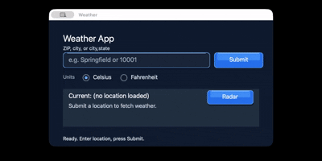

# AiLangCore

AiLangCore is the public workspace for AiLang, AiVM, and AiVectra: a deterministic, AI-native language ecosystem.

AiLang semantics are spec-governed and live in AiLang itself. AiVM is the thin, replaceable runtime boundary. AiVectra is the cross-platform vector UI layer.

## Recent milestone

A basic weather app written entirely in AiLang now runs on both macOS and Browser/WASM.

## Sponsor AiLang

Sponsorship helps keep AiLang open source while funding the practical work needed to stabilize the ecosystem: tests, docs, examples, releases, and future platform hosts.

[Watch the 15-second sponsor video](https://youtu.be/akDaNYkU0WI) · [Sponsor the project through GitHub Sponsors](https://github.com/sponsors/AiLangCore)

## Repositories

- [AiLang](https://github.com/AiLangCore/AiLang): language toolchain, standard library, SDK, and documentation.
- [AiVM](https://github.com/AiLangCore/AiVM): native C virtual machine and runtime boundary.
- [AiVectra](https://github.com/AiLangCore/AiVectra): vector UI library and SDK.
- [Website](https://ailang.codes): install scripts, documentation links, and release entrypoints.
